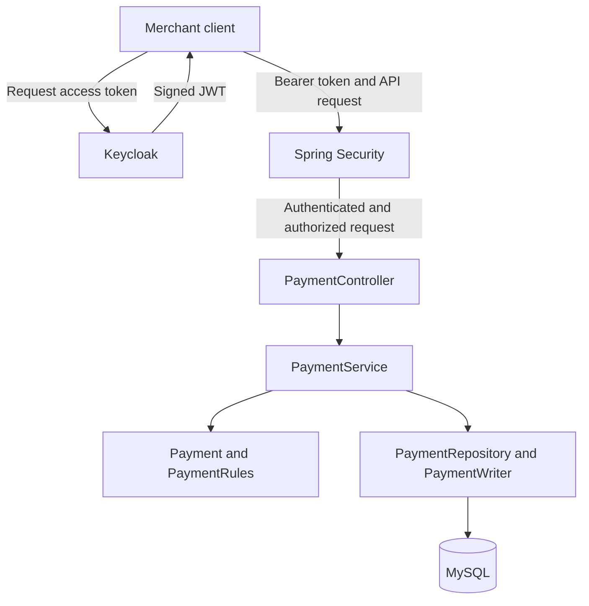
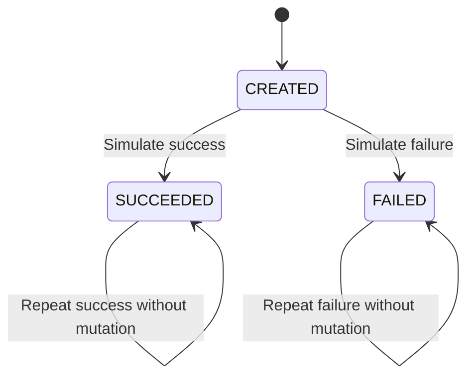

# LedgerFlow Payment Sandbox

A Java and Spring Boot backend project exploring payment API correctness through JWT authentication, merchant isolation, idempotent payment creation, and controlled payment state transitions.

This is a personal learning and portfolio project. Payment outcomes are simulated; the application does not connect to a payment gateway or move real money.

## Project Status

The initial payment API is implemented, and its main flows have been exercised manually.

Current development priorities:

1. Automate API and database integration tests.
2. Verify concurrent creation and outcome updates.
3. Implement a ledger.
4. Add a transactional outbox and Kafka integration.
5. Implement reconciliation against simulated external records.

Ledger, Kafka, outbox, and reconciliation features are planned and are not part of the current implementation.

## Why I Built This

My professional experience includes contributing to payment authentication workflows, request validation, external-service integration, and production issue investigation.

I built LedgerFlow to deepen my understanding of backend correctness: preventing duplicate records during retries, isolating merchant data, defining transaction boundaries, and protecting payment state transitions.

This repository is an independent implementation using simulated scenarios. It contains no employer source code or customer data.

## Technology Stack

| Component | Technology |
|---|---|
| Language | Java 21 |
| Application framework | Spring Boot 4.1.1 |
| API | Spring MVC REST endpoints |
| Security | Spring Security OAuth2 Resource Server |
| Identity provider | Keycloak |
| Database | MySQL 8.0 |
| Persistence | Spring Data JPA, Hibernate, and JdbcTemplate |
| Schema migrations | Flyway |
| Validation | Jakarta Bean Validation |
| Testing | JUnit |
| Build tool | Maven |

## Implemented Features

- JWT authentication using a trusted Keycloak issuer.
- Validation of token audience and merchant identity claims.
- Role-based access control for payment operations.
- Merchant-scoped payment lookup and mutation.
- Idempotent creation using a merchant-specific key and request fingerprint.
- Database uniqueness constraints to protect against duplicate creation.
- Simulated `SUCCEEDED` and `FAILED` outcomes.
- Terminal-state protection.
- Pessimistic locking during outcome updates.
- Request validation and structured business error responses.
- Versioned database schema migrations.
- Unit tests for payment fingerprinting and transition rules.

## Architecture

The application is a single Spring Boot backend organized into layers.



Keycloak handles identity and token issuance. The payment application validates tokens, enforces access rules, and manages payment data.

### Package Responsibilities

| Package | Responsibility |
|---|---|
| `payments.api` | Controllers, request records, response records, and API exception handling |
| `payments.domain` | Payment entity, payment states, and business rules |
| `payments.service` | Use-case orchestration and transaction boundaries |
| `payments.repository` | Scoped queries, locking, and explicit insertion |
| `payments.security` | JWT validation, role conversion, and merchant identity |
| `payments.exception` | Business exceptions |

## API Overview

| Method | Endpoint | Required roles | Purpose |
|---|---|---|---|
| `GET` | `/actuator/health` | Public | Application health |
| `POST` | `/api/payments` | `merchant` | Create or replay a payment |
| `GET` | `/api/payments/{paymentId}` | `merchant` | Retrieve an owned payment |
| `POST` | `/api/payments/{paymentId}/simulate` | `merchant` and `simulator` | Apply a simulated outcome |

Protected requests require:

```http
Authorization: Bearer <ACCESS_TOKEN>
```

Payment creation also requires:

```http
Idempotency-Key: merchant-a-order-1001
```

### Create a Payment

```http
POST /api/payments
Authorization: Bearer <ACCESS_TOKEN>
Idempotency-Key: merchant-a-order-1001
Content-Type: application/json
```

```json
{
  "amountMinor": 12550,
  "currency": "INR",
  "orderReference": "ORDER-1001"
}
```

`12550` minor units represents INR `125.50`.

Current input constraints:

| Field | Constraint |
|---|---|
| `amountMinor` | Integer from `1` to `100000000` |
| `currency` | `INR` |
| `orderReference` | 1–64 letters, digits, underscores, or hyphens |
| `Idempotency-Key` | 1–100 letters, digits, underscores, or hyphens |

A newly inserted payment returns:

```http
HTTP/1.1 201 Created
Location: /api/payments/<PAYMENT_ID>
Idempotency-Replayed: false
```

The response contains:

- `id`
- `orderReference`
- `amountMinor`
- `currency`
- `status`
- `createdAt`
- `updatedAt`

The initial status is `CREATED`.

### Retry the Same Request

Repeat the request with the same merchant, idempotency key, and payment details.

Expected result:

```http
HTTP/1.1 200 OK
Idempotency-Replayed: true
```

The existing payment ID is returned.

A replay returns the payment's current representation. If its outcome has changed since creation, the replay reflects that current state.

### Reuse a Key with Different Details

Reusing the same merchant and key with a different amount, currency, or order reference returns:

```http
HTTP/1.1 409 Conflict
```

The original payment is not overwritten.

### Retrieve a Payment

```http
GET /api/payments/<PAYMENT_ID>
Authorization: Bearer <ACCESS_TOKEN>
```

The lookup uses both the authenticated merchant ID and payment ID.

A payment that does not exist within that merchant's scope returns `404`.

### Simulate an Outcome

```http
POST /api/payments/<PAYMENT_ID>/simulate
Authorization: Bearer <ACCESS_TOKEN>
Content-Type: application/json
```

```json
{
  "outcome": "SUCCEEDED"
}
```

Supported outcomes are `SUCCEEDED` and `FAILED`.

The caller must have both required roles and own the payment.

## Payment State Rules



- `CREATED` can transition to either terminal outcome.
- Repeating the same terminal outcome leaves status and `updatedAt` unchanged.
- Changing `SUCCEEDED` to `FAILED`, or `FAILED` to `SUCCEEDED`, is rejected.
- `CREATED` is not a valid simulation outcome.

## Important Design Decisions

### Merchant Identity Comes from the Token

The application obtains `merchant_id` from the validated JWT.

A caller cannot choose the ownership identity by supplying a merchant ID in the payment request body.

Repository queries include the merchant ID alongside the payment identifier or idempotency key.

### Idempotency Has Database Enforcement

The database enforces a unique constraint on:

```text
(merchant_id, idempotency_key)
```

An initial lookup supports ordinary retries, but it cannot prevent a race between concurrent requests. The unique constraint provides the final duplicate-insertion protection.

A SHA-256 fingerprint of the amount, currency, and order reference distinguishes an identical retry from a conflicting request.

### Duplicate Recovery Happens After Rollback

Creation orchestration runs without an enclosing transaction and calls a separate transactional writer.

If insertion encounters a duplicate key, the writer transaction ends before the service performs a recovery lookup. This avoids continuing recovery inside the failed insertion transaction.

The concurrent recovery path still needs automated verification against MySQL.

### Outcome Updates Use a Row Lock

Outcome simulation loads the owned payment using a pessimistic write lock.

The state check and mutation occur within the same transaction. JPA dirty checking persists changes to the managed entity when the transaction commits.

### Amounts Use Minor Units

Amounts are stored as integers rather than floating-point values.

The current implementation supports INR only. Additional currencies will require an explicit policy for their minor-unit scales.

### Flyway Owns Schema Changes

Flyway applies versioned SQL migrations.

Hibernate uses:

```yaml
ddl-auto: validate
```

This checks entity mappings against the schema instead of automatically modifying database tables.

## Data Structures and Design Patterns

### Data Structures Used

| Data structure | Where it is used | Why it is used |
|---|---|---|
| `Set<String>` | Supported roles in `KeycloakRoleConverter` | Defines the allowed roles and supports membership checks |
| `Map<?, ?>` | Reading the JWT `realm_access` claim | Accesses nested token data by key |
| `Collection<?>` | Reading `realm_access.roles` | Processes the role values supplied in the token |
| `LinkedHashSet<GrantedAuthority>` | Building granted authorities | Removes duplicate authorities while preserving insertion order |
| `List<GrantedAuthority>` | Returning converted authorities | Provides an immutable result using `List.copyOf` |
| `List<String>` | Validation errors in `ApiExceptionHandler` | Holds distinct, sorted validation messages |

These collections support authentication and error handling. The project does not currently require custom trees, graphs, or advanced in-memory algorithms.

### Database Indexes

The database uses a composite unique index on:

```text
(merchant_id, idempotency_key)

## Local Setup

### Prerequisites

- JDK 21.
- MySQL Server 8.0.
- Keycloak.
- Git.
- Maven, or the Maven wrapper included in the repository.

MySQL Workbench is optional; it is a database client rather than the database server.

The current setup runs MySQL and Keycloak locally without requiring Docker.

### 1. Clone the Repository

```bash
git clone https://github.com/Suyog-S-Kulkarni/ledgerflow-payment-sandbox.git
cd ledgerflow-payment-sandbox
```

Run build commands from the directory containing `pom.xml`.

### 2. Configure MySQL

Create a database named `ledgerflow` and a local application user named `ledgerflow_app`.

The local account must have the permissions needed to access application data and apply Flyway migrations.

Configure the datasource in `src/main/resources/application.yml`:

```yaml
spring:
  datasource:
    url: "jdbc:mysql://localhost:3306/ledgerflow?connectionTimeZone=UTC&forceConnectionTimeZoneToSession=true"
    username: ledgerflow_app
    password: ${MY_PASSWORD}
```

Set `MY_PASSWORD` in the IntelliJ application run configuration.

For a PowerShell terminal session:

```powershell
$env:MY_PASSWORD = "<YOUR_LOCAL_DATABASE_PASSWORD>"
```

The environment variable name must match the placeholder in the actual application configuration.

Do not commit real credentials.

### 3. Configure Keycloak

Start the local development server from the Keycloak installation directory:

```powershell
.\bin\kc.bat start-dev --http-port=8081 --http-host=127.0.0.1
```

Create the `ledgerflow` realm.

Configure two confidential clients with client authentication and service accounts enabled:

| Client | Realm roles | Merchant claim |
|---|---|---|
| `merchant-a` | `merchant`, `simulator` | `11111111-1111-4111-8111-111111111111` |
| `merchant-b` | `merchant` | `22222222-2222-4222-8222-222222222222` |

Configure access-token mappers so each client receives:

- Its assigned UUID in a string claim named `merchant_id`.
- `ledgerflow-api` in the `aud` claim.
- Its assigned realm roles in `realm_access.roles`.

Application settings:

```yaml
spring:
  security:
    oauth2:
      resourceserver:
        jwt:
          issuer-uri: http://localhost:8081/realms/ledgerflow

app:
  security:
    audience: ledgerflow-api
```

Merge these settings into the existing YAML structure. Do not add duplicate `spring` or `security` keys under the same parent.

Client secrets belong in local credential storage and must not be committed.

### 4. Run the Application

Start MySQL and Keycloak before starting the application.

Run `payments.PaymentApplication` from IntelliJ, or use the Maven wrapper:

```powershell
.\mvnw.cmd spring-boot:run
```

On macOS or Linux:

```bash
./mvnw spring-boot:run
```

Default application URL:

```text
http://localhost:8080
```

Health endpoint:

```text
http://localhost:8080/actuator/health
```

### 5. Obtain an Access Token

Send a request to:

```http
POST http://localhost:8081/realms/ledgerflow/protocol/openid-connect/token
Content-Type: application/x-www-form-urlencoded
```

Form fields:

```text
grant_type=client_credentials
client_id=merchant-a
client_secret=<LOCAL_CLIENT_SECRET>
```

Use the returned `access_token` as the bearer token for payment requests.

When the token expires, obtain a new one and update the request headers.

## Testing

Run the test suite on Windows:

```powershell
.\mvnw.cmd test
```

On macOS or Linux:

```bash
./mvnw test
```

### Domain Unit Tests

`PaymentRulesTest` covers:

- Deterministic request fingerprinting.
- Fingerprint changes when payment details change.
- Initial transitions to success and failure.
- Repeated terminal outcomes.
- Rejected terminal-state reversals.
- Rejected `CREATED` outcomes.
- Rejected null transition inputs.

### Manual API Checks

| Scenario | Observed result |
|---|---|
| Valid payment creation | `201`, initial state `CREATED` |
| Identical retry | `200`, replay header `true`, same payment ID |
| Changed amount with the same key | `409`, original amount unchanged |
| Merchant B looks up Merchant A's payment | `404` |
| Merchant B attempts simulation without the simulator role | `403` |
| Merchant A simulates success | `200`, state `SUCCEEDED` |
| Repeat success | `updatedAt` unchanged |
| Change success to failure | `409`, state remains `SUCCEEDED` |
| Protected request without a token | `401` |

### Remaining Verification

- Concurrent identical and conflicting creation requests.
- Duplicate-key recovery after a competing transaction commits.
- Concurrent outcome updates.
- An authorized simulator attempting to modify another merchant's payment.
- Invalid issuer, audience, expiration, and merchant-claim scenarios.
- Complete request-validation and error-response coverage.
- Repeatable Java 21 packaging and automated integration tests.

Manual checks and domain unit tests do not establish production readiness or concurrency correctness.

## Error Responses

| Status | Meaning |
|---|---|
| `400` | Invalid input or malformed request |
| `401` | Missing or invalid authentication |
| `403` | Insufficient route permissions |
| `404` | Payment not found within the caller's merchant scope |
| `409` | Idempotency conflict or forbidden state change |

Business exceptions are mapped to `ProblemDetail` responses.

Authentication and authorization failures are handled by Spring Security, so their response bodies may differ from MVC business-error responses.

## Current Limitations

- Payment outcomes are simulated.
- Only INR is supported.
- There is no payment gateway, bank, or settlement integration.
- There is no card-data or biometric-data processing.
- Different idempotency keys can create separate payments for the same order reference.
- No idempotency-key expiration policy is implemented.
- Ledger, outbox, Kafka, and reconciliation are not implemented yet.
- No production throughput or latency benchmarks are claimed.

## Roadmap

- [x] Secured payment API
- [x] Merchant-scoped access
- [x] Idempotent creation
- [x] Simulated outcomes and terminal-state protection
- [x] Flyway migration and domain unit tests
- [ ] Automated API and MySQL integration tests
- [ ] Concurrency verification
- [ ] CI build and test workflow
- [ ] Balanced ledger postings
- [ ] Transactional outbox
- [ ] Kafka publishing and idempotent consumption
- [ ] Reconciliation against simulated external records
- [ ] Expanded operational logging and metrics